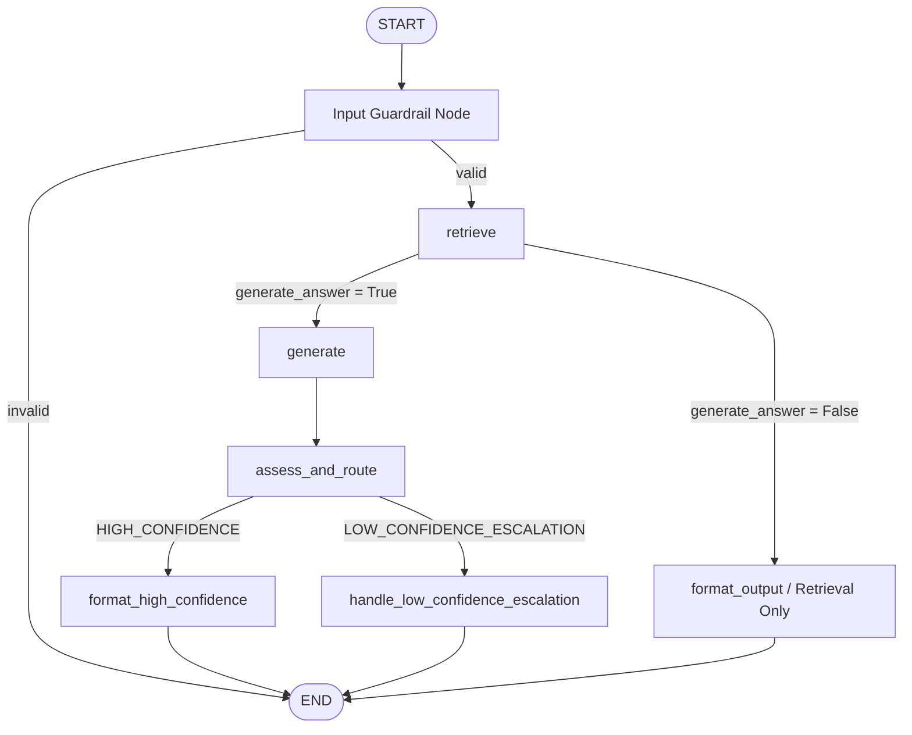

# frontline-clinical-rag

**Production-grade RAG system for clinical decision support**  
*Layout-aware hierarchical chunking • Metadata-rich hybrid retrieval • ADR-governed architecture • Clinical safety by design*

[](https://www.python.org/)
[](https://python.langchain.com/)
[](https://python.langchain.com/)
[](https://github.com/facebookresearch/faiss)
[](https://huggingface.co/BAAI/bge-m3)
[](https://docs.pydantic.dev/)
[](https://pymupdf.readthedocs.io/)
[](https://www.docker.com/)
[](https://x.ai/)
[](https://adr.github.io/)

---

## The Real Problem

Frontline healthcare workers and clinicians face **information overload** when consulting thousands of pages of trusted references like *The Merck Manual of Diagnosis & Therapy* (≈4,000 pages across 23 sections). In time-critical scenarios — sepsis protocols, appendicitis differentials, traumatic brain injury management, alopecia areata workups — they need **fast, precise, source-cited answers** grounded in authoritative text, not generic LLM hallucinations.

Traditional RAG approaches (flat RecursiveCharacterTextSplitter + basic vector search) lose critical structure in long, hierarchically organized medical documents. They also ignore clinical safety signals (black-box warnings, contraindications) that should influence retrieval ranking.

## Senior Solution: Production RAG with Clinical Intelligence

We built a **maintainable, testable, safety-conscious RAG pipeline** that treats medical documents as first-class structured artifacts:

- **HierarchicalMedicalChunker** (PyMuPDF + TOC analysis): Extracts true document hierarchy (`section_hierarchy` metadata) and detects clinical warning levels (`black_box`, `boxed_warning`, `has_warning`). Chunks carry rich, queryable metadata instead of plain text.
- **Metadata-Aware Hybrid Retrieval**: Dense embeddings (bge-m3 or OpenAI) + sparse BM25 + Reciprocal Rank Fusion (RRF) + configurable field boosting (warnings boosted up to 1.7×, hierarchy 1.2×). Two retrieval strategies side-by-side for comparison.
- **Config-Driven Factory Assembly** (ADR-005): Thin, explicit `pipeline/factory.py` wires everything from a single Pydantic `AppConfig`. No hidden singletons, full testability with overrides, clear dependency boundaries.
- **Clinical Safety Posture**: A deterministic input guardrail now runs before retrieval, and generated answers still pass through post-generation safety validation plus explicit graph routing. Every answer path is designed to be auditable.
- **ADR Governance**: Five Architecture Decision Records document context, alternatives considered, trade-offs, and consequences. This is how senior engineers ship systems that teams can maintain and audit.

**Python**, **RAG**, **LangChain**, **Vector Databases**, **Embeddings**, **hybrid retrieval**, **evaluation harness**, **modular architecture**, **Pydantic config**, and **production patterns** in a high-stakes domain.

## Architecture Overview

```
┌─────────────────────────────────────────────────────────────────┐
│                        run.py / Notebooks                       │
│              (Clinical questions • Strategy comparison)         │
└──────────────────────────────┬──────────────────────────────────┘
                               │
┌──────────────────────────────▼──────────────────────────────────┐
│                     pipeline/factory.py                         │
│   create_retriever(config)  →  HybridRetriever (RRF + boost)   │
│   (thin composition, config-driven, testable overrides)        │
└──────────────┬───────────────────────────────┬─────────────────┘
               │                               │
   ┌───────────▼───────────┐       ┌───────────▼───────────┐
   │   retrieval/          │       │   ingestion/          │
   │   hybrid_retriever.py │       │   loader.py           │
   │   (RRF, metadata boost)│       │   (HierarchicalMedicalChunker)│
   └───────────┬───────────┘       │   PyMuPDF + TOC       │
               │                   └───────────┬───────────┘
               │                               │
   ┌───────────▼───────────┐       ┌───────────▼───────────┐
   │   Vector Store        │       │   core/config.py      │
   │   (FAISS / Chroma)    │       │   (Pydantic v2, single source)│
   └───────────────────────┘       └───────────────────────┘
```

**Key Design Decisions & Trade-offs** (documented in ADRs):
- **Why hierarchical chunking?** Medical manuals are sequential and nested. Flat chunking destroys section context; hierarchical preserves it and adds safety metadata.
- **Why thin factory?** Keeps assembly logic in one place without over-abstracting. Retrieval logic stays pure and independently testable (ADR-005).
- **Why metadata boosting?** Clinical warnings and hierarchy are stronger signals than pure semantic similarity in medical QA.
- **Why Pydantic everywhere?** Type safety, validation, easy test overrides, and future guardrail flags in one maintainable source of truth.

## Current Architecture (ADR-008)

The system now includes a **deterministic LangGraph** implementation:



**Key improvements in ADR-008**:
- Deterministic `validate_input` entry node blocks obvious prompt-injection attempts before retrieval or generation
- Central `assess_and_route` node that applies safety + builds a lean `ClinicalAssessment`
- Explicit, deterministic routing using `RoutingDecision`
- No more hidden auto-escalation logic inside Pydantic validators
- Full observability (`routing_history` + LangSmith tracing)
- Clean separation of concerns: Generation produces content + signals; the Graph owns routing decisions


## Tech Stack with Senior Rationale

| Layer              | Technology                          | Why (Trade-off / Production Thinking)                          |
|--------------------|-------------------------------------|----------------------------------------------------------------|
| Language & Types   | Python 3.11 + Pydantic v2           | Type-safe config, runtime validation, excellent DX in PyCharm  |
| Orchestration      | LangChain 0.3 (LCEL ready)          | Mature RAG primitives + future chain composability             |
| Embeddings         | BAAI/bge-m3 (local) or OpenAI       | Strong medical-domain performance; local-first privacy option  |
| Vector Database    | FAISS (default) / Chroma / Weaviate | Fast local retrieval; easy swap via config                     |
| Chunking           | Custom HierarchicalMedicalChunker + PyMuPDF | Layout-aware TOC hierarchy + clinical warning detection     |
| Retrieval          | Hybrid (dense + sparse) + RRF + metadata boost | Best of semantic + lexical; safety signals influence ranking |
| LLM                | Grok (xAI) / local Ollama (llama3.1) / OpenAI fallback | Flexible, production-ready, cost/privacy options            |
| Config             | Single Pydantic AppConfig           | One source of truth; overrides for tests & experiments         |
| Testing & Eval     | ADR-009 deterministic harness | Layer A PASS/FAIL metrics over canonical Merck fixtures |
| Packaging          | pipenv + src layout                 | Reproducible environments, clean imports                       |

## Project Structure

```text
frontline-clinical-rag/
├── src/
│   └── frontline_clinical_rag/
│       ├── core/           # Pydantic AppConfig (single source of truth)
│       ├── ingestion/      # HierarchicalMedicalChunker (PyMuPDF + TOC)
│       ├── retrieval/      # Hybrid retriever, RRF, metadata boosting
│       ├── pipeline/       # Factory assembly (create_retriever)
│       ├── generation/     # (Future) LCEL chains + prompts
│       ├── safety/         # Guardrails, disclaimers, refusal logic
│       └── evaluation/     # ADR-009 deterministic fixtures, metrics, harness
├── data/
│   ├── raw/              # Merck Manual PDF (gitignored)
│   └── vector_store/     # Persisted FAISS indices
├── docs/
│   └── adr/              # 5 Architecture Decision Records
├── tests/                # Unit tests with config overrides
├── run.py                # End-to-end comparison (hierarchical vs recursive)
├── Pipfile / Pipfile.lock
├── env.example
└── README.md
```

## Quickstart

```bash
# 1. Environment
pipenv install
pipenv shell
cp env.example .env   # Fill OPENAI_API_KEY or LLM_LOCAL_*, FRONTLINE_MERCK_PDF_PATH

# 2. (Optional) Ingest / rebuild index
python -c "from src.frontline_clinical_rag.core.config import get_config; print(get_config().force_rebuild_index)"
# Set FRONTLINE_RETRIEVER_FORCE_REBUILD_INDEX=true to rebuild

# 3. Run the full graph demo; ADR-009 metrics print after each question
python run.py

# Optional standalone deterministic evaluation table with MockLLM
python run.py --mode evaluation --eval-mode harness_integration

# Optional live evaluation at temperature=0
python run.py --mode evaluation --eval-mode live_eval --strategy hierarchical
```

`run.py` imports the four canonical Merck questions from `src/frontline_clinical_rag/evaluation/fixtures.py` and preserves the full question-by-question graph demo as the default. After each generated answer, it prints the ADR-009 deterministic metric result for that final graph state. The standalone `--mode evaluation` path is available when you want only the compact benchmark table or optional CSV/JSON artifacts.

## Deterministic Evaluation

ADR-009 adds a lean deterministic evaluation harness for Clinical RAG. It keeps benchmark orchestration outside the production LangGraph while still executing the normal generated path: `validate_input → retrieve → generate → assess_and_route → format_high_confidence` or `handle_low_confidence_escalation`.

Phase 1 deliberately rejects LLM judges, RAGAS, and heavy notebook reporting. Metrics M1-M12 are computed from the final `ClinicalRAGState` plus the centralized `core.config.EvaluationConfig`; they do not call an LLM, use randomness, or read wall-clock time except for the informational `latency_recorded` value.

Run modes:

- `metric_unit`: tests injected state fixtures and pure metric functions. This is the Layer A determinism target for CI.
- `harness_integration`: runs all canonical Merck fixtures through the graph with deterministic MockLLM/MockRetriever objects. This proves harness wiring without provider variance.
- `live_eval`: runs the real retrieval + generation path at `temperature=0`. This is useful for portfolio evidence and local regression, but identical live LLM output is not guaranteed.

CLI examples:

```bash
python run.py --mode evaluation --eval-mode harness_integration
python run.py --mode evaluation --eval-mode harness_integration --compare-strategies
python run.py --mode evaluation --eval-mode live_eval --strategy hierarchical --csv reports/eval.csv --json reports/eval.json
python -m src.frontline_clinical_rag.evaluation.harness --mode harness_integration
```

The console table reports per-question PASS/FAIL plus optional CSV/JSON artifacts. M1-M11 gate each question; M12 latency is informational only.

## Architecture Decision Records (ADRs)

Transparent senior decision-making is a first-class deliverable:

| ADR     | Focus                                              | Key Outcome                                      |
|---------|----------------------------------------------------|--------------------------------------------------|
| ADR-001 | Initial core setup & package boundaries            | Clean src/ layout, config foundation             |
| ADR-002 | Hierarchical chunking & clinical metadata          | `section_hierarchy` + warning level flags        |
| ADR-003 | (Intermediate)                                     | -                                                |
| ADR-004 | Metadata-aware hybrid retrieval + RRF              | Boosting rules, hybrid composition               |
| ADR-005 | Lightweight pipeline factory                       | Thin assembly, testability, safety posture       |
| ADR-006 | Safety & Validation Layer                          | `ClinicalResponse`, `SafetyCritic`, guardrails   |
| ADR-007 | Initial LangGraph introduction                     | Move from LCEL to explicit `StateGraph`          |
| ADR-008 | Explicit Certainty-Aware Control Flow              | `assess_and_route` node + deterministic routing  |
| ADR-009 | Lean Deterministic Evaluation Harness              | Pure Layer A metrics + canonical fixtures        |

All ADRs live in `docs/adr/`. Reading them shows how we evaluate alternatives, document trade-offs, and protect long-term maintainability — a hallmark of Staff-level engineering.

## Production Readiness & Roadmap

**Current strengths**:
- Fully config-driven and reproducible
- Deterministic LangGraph with first-node input guardrail and explicit clinical routing (ADR-008)
- Rich clinical metadata for safety-aware behavior
- Prompt-injection detection is covered with edge-case and performance tests
- Deterministic ADR-009 evaluation harness for canonical clinical fixtures
- All core tests passing (68+ tests)

**Next milestones** (tracked via ADRs/issues):
- Generation layer with Grok / local LLMs + source citation enforcement
- Richer Phase 2 evaluation only after the deterministic ADR-009 baseline is stable
- Stronger output guardrails and refusal handling for out-of-scope / contradictory queries
- Docker packaging + CI/CD pipeline
- Observability (LangSmith alternative or custom tracing)
- Multi-profile pipelines (dev vs. safety-eval vs. production)

This roadmap deliberately prioritizes **safety and evaluation before full generation** — non-negotiable for any clinical decision-support system.

## Medical Disclaimer

**This is an educational and portfolio project only.**  
It is **not intended for clinical use**, diagnosis, or treatment decisions. All information retrieved must be verified against primary sources and qualified medical judgment. The authors and contributors accept no liability for any clinical decisions made based on this system.

Designed with explicit safety metadata and guardrail hooks precisely because we understand the stakes.

## Why This Repository Signals Senior AI Engineering Capability

- **End-to-end production RAG**, not a toy notebook
- **Domain adaptation** for safety-critical long documents (layout intelligence + metadata)
- **Architectural discipline** via ADRs and clean boundaries
- **Testability & reproducibility** built in from day one
- **Direct keyword alignment** with top AI Engineer job descriptions: Python, LLMs, RAG, LangChain, Vector Databases, Embeddings, Hybrid Retrieval, Evaluation, Modular Python Architecture, Pydantic, Clinical AI

---

*Built with ❤️ for clinical excellence and engineering craft. Power ahead.*
